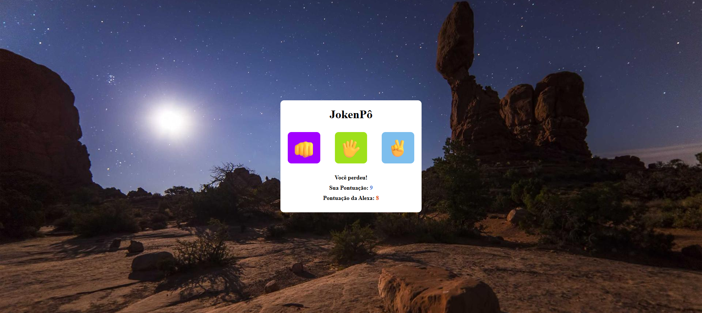

<h1>✊✋✌️ Jogo de JokenPô</h1>

Um jogo simples de JokenPô (Pedra, Papel e Tesoura) desenvolvido utilizando HTML, CSS e JavaScript.
O jogador enfrenta o computador em partidas rápidas e interativas diretamente no navegador.

<h3>🎮 Demonstração</h3>

O jogador escolhe entre Pedra, Papel ou Tesoura, enquanto o computador faz uma escolha aleatória.
O resultado da rodada é exibido na tela indicando vitória, derrota ou empate.

<h3>🚀 Tecnologias Utilizadas</h3>

-  - Estrutura da página
-  - Estilização e layout
-  - Lógica do jogo e interatividade

<h3>📂 Estrutura do Projeto</h3>

jokenpo/

│

├── index.html              -                 # Estrutura da página

├── style.css               -                 # Estilos do jogo

├── script.js               -                 # Lógica do jogo

└── README.md               -                 # Documentação do projeto

<h3>🕹️ Como Jogar</h3>

<strong>1.</strong> Escolha entre:

- ✊ Pedra

- ✋ Papel

- ✌️ Tesoura

<strong>2.</strong> O computador fará uma escolha aleatória.

<strong>3.</strong> O resultado será exibido na tela.

<h3>Regras</h3>

- Pedra ✊ vence Tesoura  ✌️

- Tesoura  ✌️ vence Papel ✋

- Papel ✋ vence Pedra ✊

 <h3>⚙️ Como Executar o Projeto</h3>  

 https://atosrafael.github.io/JokenP-/

<h3>📸 Previews</h3>  

